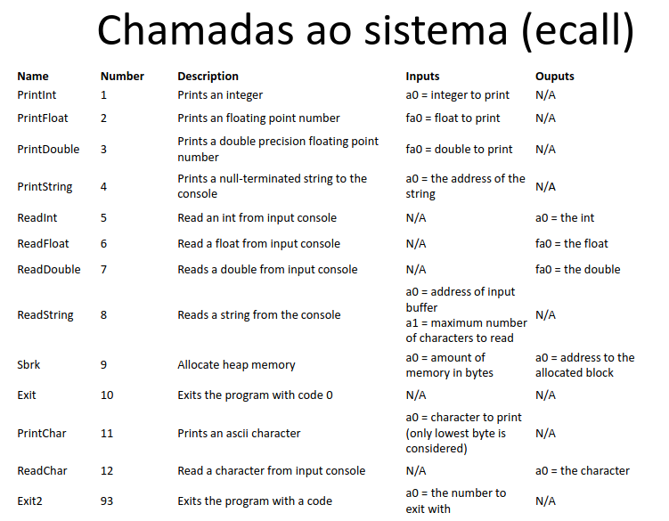
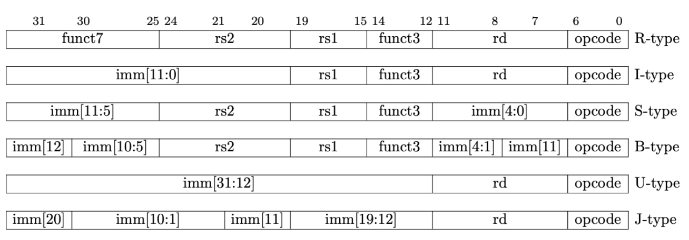

# Notas de aula

## Arquitetura RISC-V

- Arquitetura de 32 bits
- 32 registradores de propósito geral
- 32 registradores para float

## Compilando .asm

1. sudo apt install nasm
2. sudo apt install binutils
3. nasm -f elf64 file.asm -o file.o (monta arquivo)
4. ld file.o -o file (cria executável)

## Estrutura de código

- `.data` - Início da seção de dados estáticos
- `.text` - Início da seção de código
- `.global label` - Entry point. Permite que outros arquivos chamem essa função durante o processo de link.

## Diretivas

- `.align n` - Alinha a memória em `2^n` bytes. Força o próximo dado/instrução a começar em um endereço de memória alinhado, utilizando padding.
    - `n = 0` para strings.
    - `n = 2` para instruções.
- `label: .asciz str` - Guarda string e encerra ela com `\0`
- `label: .byte b1,...,bn` - Reserva e inicializa cada byte sequencialmente.
- `label: .word w1,...,wn` - Reserva e inicializa cada word sequencialmente.
- `label: .double d1,...,dn` - Reserva e inicializa cada double sequencialmente.
- `label: .space n` - Reserva imm bytes

## Registradores

- `ra` - Return address
- `sp` - Stack pointer
- `t0-t6` - Temporary
- `a0-a6` - Function arguments
- `a7` - Syscall register
- `s0-s11` - Saved values

## Comandos

[Risc-V Cheat Sheet](https://projectf.io/posts/riscv-cheat-sheet/)

Aritmética

- `add rd, rs1, rs2` - `rd = rs1 + rs2` (2 registradores)
- `addi rd, rs1, imm` - `rd = rs1 + imm` (1 registrador, 1 valor imediato/constante)
- `sub rd, rs1, rs2` - `rd = rs1 - rs2`
- `mul rd, rs1, rs2` - `rd = rs1 * rs2`
- `div rd, rs1, rs2` - `rd = rs1 / rs2`
- `rem rd, rs1, rs2` - `rd = rs1 % rs2`

Load/Store

- `lw rd, imm(rs1)` - `rd = mem[rs1+imm]` (word = 4 bytes)
- `lb rd, imm(rs1` - `rd = mem[rs1+imm]` (byte)
- `sw rs2, imm(rs1)` - `mem[rs1+imm] = rs2`
- `sb rs2, imm(rs1)` - `mem[rs1+imm] = rs2`

Jump/Function

- `j label` - `pc += label`
- `jal rd, label` - `rd = pc+4; pc += label` (salva endereço de retorno)
- `jr ra` - `pc = ra`
- `call symbol` - `ra = pc+4; pc = &symbol`
- `ret` - `pc = ra`

Branch (imm pode também ser um label)

- `beq rs1, rs2, imm` - `if(rs1 == rs2) pc += imm`
- `bne rs1, rs2, imm` - `if(rs1 != rs2) pc += imm`
- `blt rs1, rs2, imm` - `if(rs1 < rs2) pc += imm`
- `ble rs1, rs2, imm` - `if(rs1 <= rs2) pc += imm`
- `bgt rs1, rs2, imm` - `if(rs1 > rs2) pc += imm`
- `bge rs1, rs2, imm` - `if(rs1 >= rs2) pc += imm`

Comparadores

- `slt rd, rs1, rs2` - `rd = (rs1 < rs2)`
- `slti rd, rs1, imm` - `rd = (rs1 < imm)`

## Ecalls

- `a7` - Armazena número da ecall
- `ecall` - Chama a ecall



## Alocando na stack

Empilhando

- `addi sp, sp, -8` - Reserva 8 words
- `sw a0, 4(sp)` - Salva `a0` na stack (sp+4)
- `sw ra, 0(sp)` - Salva `ra` na stack (sp)

Desempilhando

- `lw a0, 4(sp)`
- `lw ra, 0(sp)`
- `addi sp, sp, 8`

## Tipos das instruções



### Tipo R

- `opcode - Código da operação
- `rd - Endereço do registrador destino
- `funct3 - Auxílio para definição da operação
- `rs1 - Endereço do primeiro registrador de origem
- `rs2 - Endereço do segundo registrador de origem
- `funct7 - Auxílio para definição da operação

Ex: add s2, s1, 0

```
0000000 01000 01001 000 10010 0110011
```

### Tipo I

- `opcode` - Código da operação
- `rd` - Endereço do registrador destino
- `funct3` - Auxílio para definição da operação
- `rs1` - Endereço do primeiro registrador de origem
- `imm` - Valor imediato

Ex: lw s2, 0(sp)

```
000000000000 00010 010 10010 0000011
```

### Tipo S

- `opcode` - Código da operação
- `imm[4:0]` e `imm[11:5]` - Valor imediato (Separa os bits)
- `funct3` - Auxílio para definição da operação
- `rs1` - Endereço do primeiro registrador de origem
- `rs2` - Endereço do segundo registrador de origem

Ex: sw s2, 0(sp)

```
00000000 10010 00010 010 00000 0100011
```

## Tipo B

- `opcode` - Código da operação
- `imm[4:0]`, `imm[11]`, `imm[11:5]`, `imm[12]` - Valor imediato
- `funct3` - Auxílio para definição da operação
- `rs1` - Endereço do primeiro registrador de origem
- `rs2` - Endereço do segundo registrador de origem

Ex: beq s1, s0, 4

```
0 000000 01000 01001 000 0100 0 1100011
```

## Tipo U

- `opcode` - Código da operação
- `rd` - Endereço do registrador destino
- `imm[31:12]` - Valor imediato

Ex: lui s0, 0x01234

```
[0000 0001 0010 0011 0100] 01000 0110111
```

## Tipo J

- `opcode` - Código da operação
- `rd` - Endereço do registrador destino
- `imm[20]`, `imm[10:1], `imm[11]`, `imm[19:12]` - Valor imediato

Ex: jal s0, -4

```
1 1111111100 1 11111111 01000 1101111
``` 
