# Notas de aula

## Arquitetura de Von-Neumann

Design de computador onde as instruções e dados são armazenados no mesmo espaço de memória. Os componentes são:

- CPU (CU + ALU)
- Registradores armazenados na CPU
- Dispositivos I/O operados pela CU
- Memória

### CPU

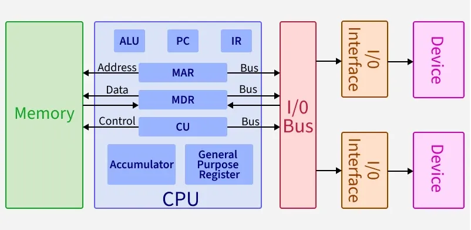

- **CU (Control Unit)** - Gerencia como o processador funciona mandando sinais de controle (0/1) ao decodificar instruções.
- **ALU (Arithmetic and Logic Unit)** - Parte da CPU que lida com cálculos. Performa adição, subtração e operações lógicas, como comparações e deslocamento de bits em dados.

### Registers

Tipo mais rápido de memória localizado na CPU.

- **PC (Program Counter)** - Endereço da próxima instrução a ser executada
- **IR (Instruction Register)** - Mantém a instrução atual sendo executada
- **MAR (Memory Address Register)** - Armazena o endereço da localização de memória sendo acessada
- **MDR (Memory Data Register)** - Armaza dados transferidos da/para a memória
- **Accumulator** - Armazena resultados intermediários de aritmética e operações lógicas
- **General Purpose Registers** - Uso para armazenamento temporário de dados

### Bus

Sistema de comunicação que transfere dados, endereços, e sinais de controle entre a CPU, memória e dispositivos I/O. Na arquitetura de Von Neumann, um único bus é compartilhado para ambos dados e instruções.

## Ciclo de instrução

Dois passos:
- Ciclo de busca (fetch)
- Ciclo de execução (execute)

### Ciclo de busca

- PC tem endereço da próxima instrução
- Processador busca instrução na posição de memória armazenada no PC
    - MAR = PC
    - MBR = memória(MAR)
- PC = PC+4 (exceto em branch)
- Instrução armazenada no IR - IR = MBR

### Ciclo de execução

- CU decodifica instrução e define sinais de controle
- Execução da instrução se resume a uma das seguintes possibilidades:
    - **Processador-memória**: Transferir dados do processador para a memória ou vice-versa
    - **Processador-I/O**: Transferir dados entre processador e dispositivo I/O
    - **Processamento de dados**: Executar operações aritméticas/lógicas sobre os dados
    - **Controle**: Especifica que a sequência de execução de instruções seja alterada
    - **Combinação dessas 4 possibilidades**

## Arquitetura RISC-V

- Arquitetura de 32 bits
- 32 registradores de propósito geral
- 32 registradores para float

### Compilando .asm

1. sudo apt install nasm
2. sudo apt install binutils
3. nasm -f elf64 file.asm -o file.o (monta arquivo)
4. ld file.o -o file (cria executável)

### Estrutura de código

- `.data` - Início da seção de dados estáticos
- `.text` - Início da seção de código
- `.global label` - Entry point. Permite que outros arquivos chamem essa função durante o processo de link.

### Diretivas

- `.align n` - Alinha a memória em `2^n` bytes. Força o próximo dado/instrução a começar em um endereço de memória alinhado, utilizando padding.
    - `n = 0` para strings.
    - `n = 2` para instruções.
- `label: .asciz "str"` - Guarda string e encerra ela com `\0`
- `label: .byte b1,...,bn` - Reserva e inicializa cada byte sequencialmente.
- `label: .word w1,...,wn` - Reserva e inicializa cada word sequencialmente.
- `label: .double d1,...,dn` - Reserva e inicializa cada double sequencialmente.
- `label: .space n` - Reserva n bytes

### Registradores

- `ra` - Return address
- `sp` - Stack pointer
- `t0-t6` - Temporary
- `a0-a6` - Function arguments
- `a7` - Syscall register
- `s0-s11` - Saved values

### Comandos

[Risc-V Cheat Sheet](https://projectf.io/posts/riscv-cheat-sheet/)

Aritmética

- `add rd, rs1, rs2` - `rd = rs1 + rs2` (2 registradores)
- `addi rd, rs1, imm` - `rd = rs1 + imm` (1 registrador, 1 valor imediato/constante)
- `sub rd, rs1, rs2` - `rd = rs1 - rs2`
- `mul rd, rs1, rs2` - `rd = rs1 * rs2`
- `div rd, rs1, rs2` - `rd = rs1 / rs2`
- `rem rd, rs1, rs2` - `rd = rs1 % rs2`
- `remu rd, rs1, rs2` - `rd = rs1 % rs2` (unsigned remainder)
- `xor rd, rs1, rs2` - `rd = rs1 xor rs2`

Load/Store

- `la rd, label` - `rd = label_addr`
- `lw rd, imm(rs1)` - `rd = mem[rs1+imm]` (word = 4 bytes)
- `lb rd, imm(rs1` - `rd = mem[rs1+imm]` (byte)
- `sw rs2, imm(rs1)` - `mem[rs1+imm] = rs2`
- `sb rs2, imm(rs1)` - `mem[rs1+imm] = rs2`

Jump/Function

- `j label` - `pc += label` (Obs: Usa half-words para pular. `jmp 4` - `pc += 4 * 2 bytes`)
- `jal rd, label` - `rd = pc+4; pc += label` (salva endereço de retorno)
- `jr ra` - `pc = ra`
- `call symbol` - `ra = pc+4; pc = &symbol`
- `ret` - `pc = ra`

Branch (imm pode também ser um label)

- `beq rs1, rs2, imm` - `if(rs1 == rs2) pc += imm`
- `bne rs1, rs2, imm` - `if(rs1 != rs2) pc += imm`
- `blt rs1, rs2, imm` - `if(rs1 < rs2) pc += imm`
- `ble rs1, rs2, imm` - `if(rs1 <= rs2) pc += imm`
- `bgt rs1, rs2, imm` - `if(rs1 > rs2) pc += imm`
- `bge rs1, rs2, imm` - `if(rs1 >= rs2) pc += imm`
- `bnez rs1, imm` - `if(rs1 != 0) pc += imm`

Comparadores

- `slt rd, rs1, rs2` - `rd = (rs1 < rs2)`
- `slti rd, rs1, imm` - `rd = (rs1 < imm)`

### Ecalls

- `a7` - Armazena número da ecall
- `ecall` - Chama a ecall


### Alocando na stack

Empilhando

- `addi sp, sp, -8` - Reserva 8 words
- `sw a0, 4(sp)` - Salva `a0` na stack (sp+4)
- `sw ra, 0(sp)` - Salva `ra` na stack (sp)

Desempilhando

- `lw a0, 4(sp)`
- `lw ra, 0(sp)`
- `addi sp, sp, 8`

### Instruction Set Architecture

Modelo abstrato que define a interface programável da CPU do computador, definindo como o software interage com o hardware. Um dispositivo que interpreta as instruções descritas por uma ISA é uma implementação da ISA.

- Quantidade e função dos registradores
- Formato das instruções (6 tipos)

### Formato das instruções (6 tipos)


#### Tipo R (register)

Operações matemáticas e lógicas: `add`, `sub`, `and`, `or`, `sll`

- `opcode` - Código da operação
- `rd` - Endereço do registrador destino
- `funct3` - Auxílio para definição da operação
- `rs1` - Endereço do primeiro registrador de origem
- `rs2` - Endereço do segundo registrador de origem
- `funct7` - Auxílio para definição da operação

Ex: add rd1, rs1, rs2

```
0000000 01000 01001 000 10010 0110011
```

#### Tipo I (immediate)

Operações aritméticas com constantes ou instruções de leitura da memória: `addi`, `lw`, `andi`, `jalr`

- `opcode` - Código da operação
- `rd` - Endereço do registrador destino
- `funct3` - Auxílio para definição da operação
- `rs1` - Endereço do primeiro registrador de origem
- `imm` - Valor imediato

Ex: lw s2, 0(sp)

```
000000000000 00010 010 10010 0000011
```

#### Tipo S (Store)

Escrever dados de um registrador para a memória: `sw`

- `opcode` - Código da operação
- `imm[4:0]` e `imm[11:5]` - Valor imediato (Separa os bits)
- `funct3` - Auxílio para definição da operação
- `rs1` - Endereço do primeiro registrador de origem
- `rs2` - Endereço do segundo registrador de origem

Ex: sw s2, 0(sp)

```
00000000 10010 00010 010 00000 0100011
```

#### Tipo B (branch)

Desvios condicionais: `beq`, `bne`, etc

- `opcode` - Código da operação
- `imm[4:0]`, `imm[11]`, `imm[11:5]`, `imm[12]` - Valor imediato
- `funct3` - Auxílio para definição da operação
- `rs1` - Endereço do primeiro registrador de origem
- `rs2` - Endereço do segundo registrador de origem

Ex: beq s1, s0, 4

```
0 000000 01000 01001 000 0100 0 1100011
```

#### Tipo U (Upper immediate)

Carregar números muito grandes diretamente nos bits superiores de um registrador: `lui`, `auipc`

- `opcode` - Código da operação
- `rd` - Endereço do registrador destino
- `imm[31:12]` - Valor imediato

Ex: lui s0, 0x01234

```
[0000 0001 0010 0011 0100] 01000 0110111
```

#### Tipo J

Pulos incondicionais de longo alcance (chamadas de função e desvios obrigatórios): `jal`

- `opcode` - Código da operação
- `rd` - Endereço do registrador destino
- `imm[20]`, `imm[10:1]`, `imm[11]`, `imm[19:12]` - Valor imediato

Ex: jal s0, -4

```
1 1111111100 1 11111111 01000 1101111
```

## Monociclo (RISC-V)

A instrução é executada em um único ciclo de clock. Final de ciclo: tudo o que está nas conexões (linhas) é salvo nos registradores. 

Componentes: PC, Banco registradores, ULA, UC, Memória, I/O

Conjunto reduzido de instruções:

- Tipo R: add, sub, and, or
- Tipo I: lw
- Tipo S: sw
- Tipo B: beq

### Metodologia de Clocking

Quaisquer valores armazenados em um elemento lógico sequencial são atualizados apenas em um transição de clock: `State 1 -> Combinational Logic -> State 2`, em apenas 1 ciclo de clock.

### Componentes

#### Arquitetura do banco de registradores

READ
1. 32 registradores
2. A saída de cada registrador vai para 2 MUX (saída duplicada)
3. 5 bits entram no Select do primeiro MUX -> Read Register 1 (5 bits)
4. 5 bits entram no Select do segundo MUX -> Read Register 2 (5 bits)
5. Saída do primeiro MUX -> Read Data 1 (32 bits)
6. Saída do segundo MUX -> Read Data 2 (32 bits)

WRITE
1. 32 registradores
2. Entrada Write Register (5 bits)
3. Entrada Write Data (32 bits)

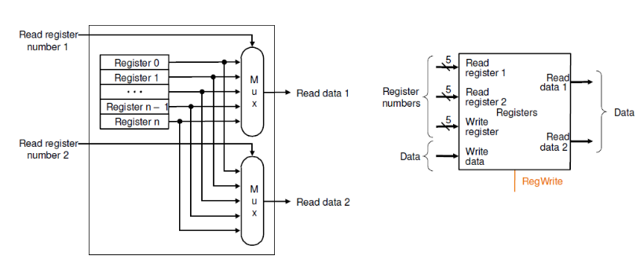

#### Arquitetura da ALU

ALU:

1. Recebe 2 entradas (32 bits)
2. Devolve saída (32 bits)

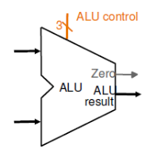

#### Arquitetura de operações com memória

Mem. Instrução:

1. Recebe endereço do PC (32 bits)
2. Devolve instrução (32 bits)

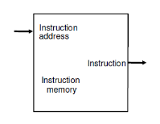

Mem. Dados:

1. Recebe endereço da ULA (32 bits)
2. Devolve Read Data (32 bits)

ou...

1. Recebe endereço (32 bits)
2. Escreve Write Data (32 bits)

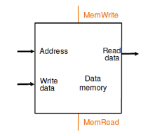

### Execução de instruções

#### Execução das instruções tipo R

- Leitura de dois registradores
- Realização de operação aritmética/lógica
- Escrita do resultado no registrador

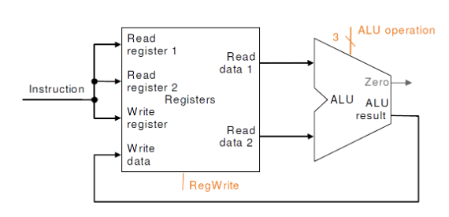

#### Execução de load/store

- load
    - Leitura de registrador origem e valor imediato
    - Calcula endereço usando deslocamento de 12 bits (usa ALU)
    - Lê a memória e atualiza o registrador destino
- Store
    - Leitura de dois registradores origem e valor imediato
    - Calcula endereço usando deslocamento de 12 bits (usa ALU)
    - Escreve o valor do registrador na memória

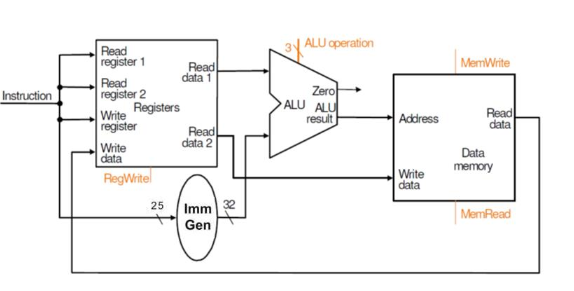

#### Execução de Branch

- Leitura de registradores
- Comparação dos dois através da ALU (se forem iguais, zero = 1)
- Endereço destino = PC + offset

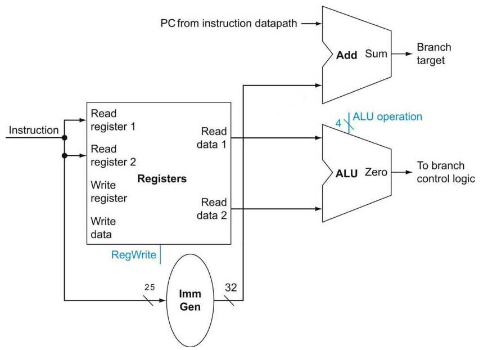

### Arquitetura completa

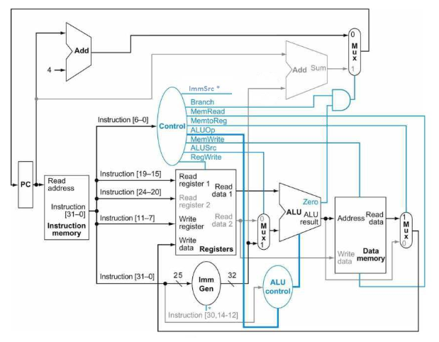

### ALU

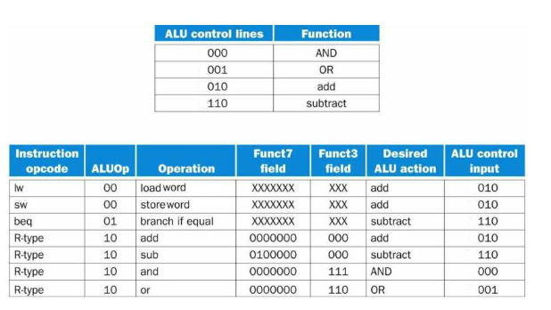

### ImmGen

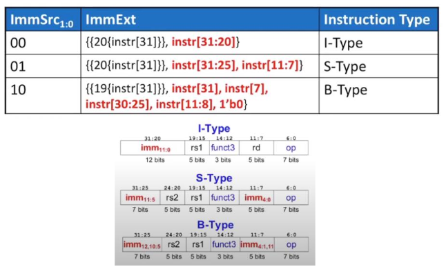

### CU

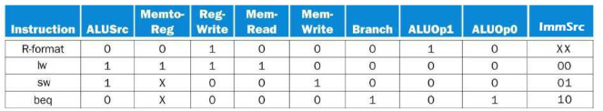

## Notas avulsas

### -4 em binário (20 bits)

Ao invés de usar bit de sinal, podemos usar complemento de dois: Inverte e soma 1.

```
00000000000000000100 -> 4
11111111111111111011 -> Complemento
+                  1
--------------------
11111111111111111100 -> -4
```

### Formato de números inteiros

- 1 bits de sinal, 15 bits de magnitude

# Revisão de Lógica digital

## Circuitos combinacionais e sequenciais

- Circuitos combinacionais - Função apenas de sinais de entrada
- Circuitos sequenciais - Sinal de saída depende dos sinais anteriores de saída

## Identidades básicas

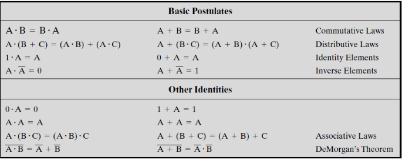

## Mapas de Karnaugh

Bits em ordem de Gray code (apenas 1 bits muda de estado a cada incremento/decremento)

Soma de produtos: Agrupar 1's em clusters de 1,2,4,8,...

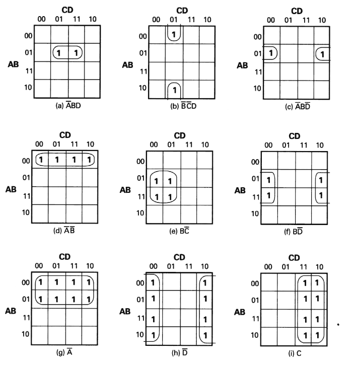

## Principais circuitos

- Half Adder - 2 entradas, 1 saída, 1 Cout
- Full Adder - 2 entradas, 1 Cin, 1 saída, 1 Cout
- Demux - Entrada de $n$ bits, saída de $2^n$ bits. Somente uma saída é ativada para cada combinação de entradas.
- Mux - Até $2^n$ entradas e $n$ valores seletores. Direciona uma das entradas para a saída.

## Flip Flops

São circuitos sequenciais.

### Flip-Flop S-R

- Duas entradas: $S$ (set) e $R$ (reset)
- Duas saídas: $Q$ e $\bar{Q}$
- S=R=1 deve ser evitada. Resolve-se com flip-flop de entrada única (Flip-Flop D)

### Flip-Flop J-K

- J=K=0 - Mantém
- J=1, K=0 - Saída = 1
- J=0, K=1 - Saída = 0
- J=K=1 - Inverte

## Registradores

Exemplo de uso de flip-flops.

- Registradores paralelos - Carregamento e descarregamento feito simultaneamente.
- Registradores de deslocamento - Transfere informações serialmente. Uso em I/O e também dentro da ALU (deslocamento lógico e rotação)
- Contadores - Registrador cujo valor é incrementado de 1 módulo a capacidade do registrador.
