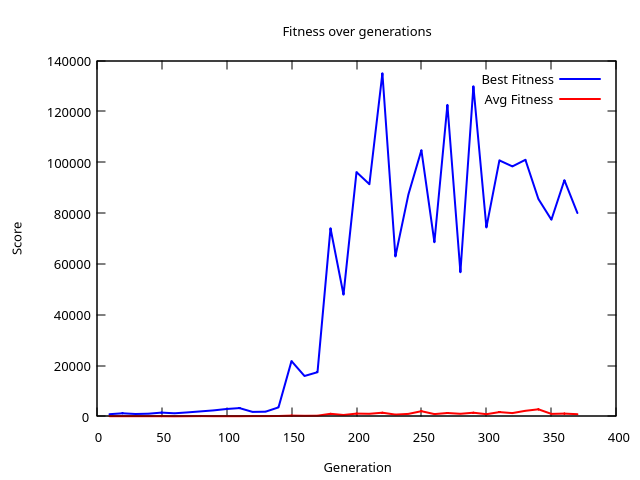

# Trials settings

Game: Avoid obstacles. +1 point per successfully move. Player dies if colliding with an obstacle, or if trying to move out of map bounds.

Neural network config:

- `8` inputs (equals number of sensors).
- `n` (to be defined) first Layer neurons.
- `8` ouput Layer neurons (8 possible moves).

Batches: Help to avoid lucky players. The roulette will select players after  `n` rounds.

## EA-DATA-001.csv, EA-Best-Weights-001.csv

- Number of individuals: `100`
- Batch: `10`
- Number of W1 Bits: `10`
- Number of W2 Bits: `10`
- Number of L1 Neurons: `12`
- Number of L2 (Outputs) Neurons: `8`
- Map Widht: `64`
- Map Height: `64`
- Tax of inserting new pieces: `0.1`
- Number of moves before pieces position update: `1`
- Max distance of sensors: `10`
- Number of sensors: `8` (front, back, left, right, front-right, front-left, back-right, back-left)
- Total of generations: `370`

